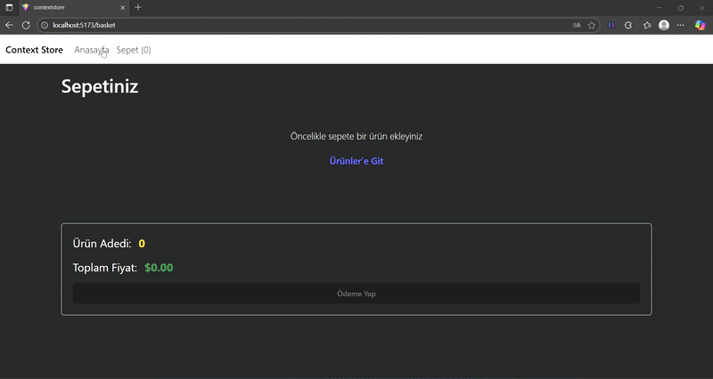

# 🛒 ContextStore 

Bu proje,**React* kullanılarak geliştirilmiş bir alışveriş sepeti uygulamasıdır.
Uygulama api üzerinden ürünleri dinamik olarak çeker ve kullanıcıların bu ürünleri sepete eklemesine veya çıkarmasına olanak tanır.

---

# 🧩Özellikler

- **API Entegrasyonu* — Ürünler `https://dummyjson.com/products` adresinden çekilir.  
- **Context API* — Global state yönetimi için `ProductContext` ve `BasketContext` kullanılmıştır.  
- **Sepet Yönetimi* — Ürün ekleme, çıkarma ve miktar güncelleme işlemleri.  
- *React Router* — Sayfa geçişleri:  
- **Bootstrap* — Responsive ve modern arayüz tasarımı.  
- **React-Toastify*

---

# 🎥Önizleme

